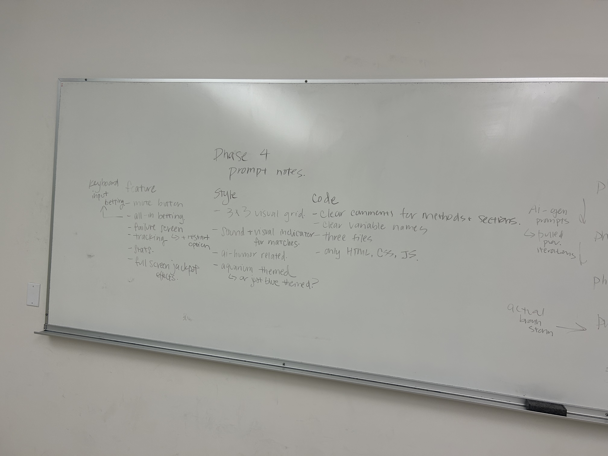
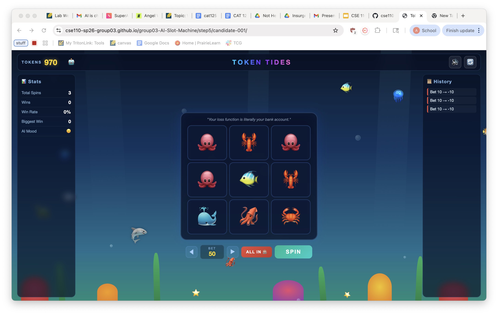

# Final Report 

## Phase 1

We agreed upon a rubric for evaluation, which included both code and design qualities. 

Key features we looked for in **design** were functionality, styling, and adherence to the prompt. 

Key features we looked for in **code** were quality of indentation, spacing, documentation, etc. 

Ori handled a lot of the repository setup to get us ready, including prepared candidate files and standardized metrics markdown files. 

## Phase 2

50 generations, split between ~9-10 Claude Code accounts. 

The model used was claude-opus-4-6 (1M context) and each instance was ran separtely with no carried over context or references. 

All used original-prompt.txt.

#### Key notes from this section:

- similar structure and layout
- some candidates had unique features (some variance)
  - sound effects
  - "all-in" button
  - payout tracking
  - animations
- some candidates had many bugs
- low code quality with minimal comments and messy styling

#### Key stats:

~20-30 tokens in, anywhere from 5k to 20k+ output tokens

## Phase 3A

5 top candidates, refined prompt, 5 new generations. 

We selected candidates 49, 16, 36, 47, and 10, all for unique features or designs that stood out to us. 

The refined prompt was created using the Claude Code interfact through the Claude App, where we gave it reference material (step 1 results, original prompt, reference directories) and other constraints from the assignment (200 words). This prompt can be found in prompt-step2.txt.

#### Key notes from this section:

- extended key features
- visuals started to merge into similar look 
- increased presence of bugs, visual and functionality issue
- still low quality code, poor commenting. 

#### Key stats:

~50 tokens in, ~20k output tokens

## Phase 3B

3 top candidates, refine prompt, 3 new generations. 

We selected candidates 2, 3, and 5, and mostly selected based on visual appeal and functionality. 

The refined prompt was created in a similar manner to Phase 3A

#### Key notes from this section:

- refined wanted features and details
  - all in button
  - no upper limit cap
- added in details about code quality
  - more commenting, better variable names 

#### Key stats:

~50-200 tokens in (lot of difference, not sure why), ~15k output tokens

## Phase 4

2 candidates, new prompt, 2 generations.

We had very poor results from the last phase, and ended up going by elimination. 

We selected candidates 1 and 2, for the simple reason that they had the least significant bugs. 

For the new prompt, we used a different, more team-focused approach. We sat down and had a brainstorming session to condense down the most important features, design, and code quality elements we had gathered from the last few rounds of iterations. We also added a more team theme relevant styling instruction.

We then used this to create a more focused prompt with less words, and generated two outputs. 

#### Key notes from this section:

- much better quality 
- good styling, more aligned with team theme
- features condensed down to only those that the team wanted to include 
  - removed a "temperature" dial that had been an artifact carried over from previous iterations
- new 3x3 grid discovered, alternative slot machine style
- code quality vastly improved
  - better commenting, styling, etc.
  - some bugs still present

#### Key stats:

~20 tokens in, ~20k & ~80k output tokens (not sure why such a huge gap)

## Phase 5

We selected a candidate from the last phase to refine one last time (candidate 002).

This is what the final version looks like:

The link can be found here: [Try It Here!](https://cse110-sp26-group03.github.io/group03-AI-Slot-Machine/step5/candidate-001/)

#### Key notes from this section:

- fixed some buggy details that were present in the last iteration
- added a more vibrant background (fish swimming around)
- refined functionality
- retained the 3x3 slot grid style
- code quality maintained, commenting and styling

#### Key stats:

~791 input, ~82k output

## Final Takeaways

AI code development is very useful in very quickly creating technically functional generic iterations of ideas. However, it does have limitations, particularly in generic styling, code readability, and bugginess. 

We found that quality of prompt did have influence on the quality of final product. Longer, more wordy, less concise, less focused prompts produced bigger token costs, more buggy outputs, and overall low-quality results. 

Giving more focused prompts with human-led brainstorming and design selection led to better output quality and more personalized final products, though still retained a lot of the generic AI-style design in both code and user interface. 

Overall, this was a really good experiment that helped teach us how to use these new tools (especially as they become more commonplace in the modern tech sphere) as well as learn their strengths and weaknesses. It also was an excellent exercise in teamwork and collaboration, and taught us a lot about how we can work as a development team working forward. 

---

